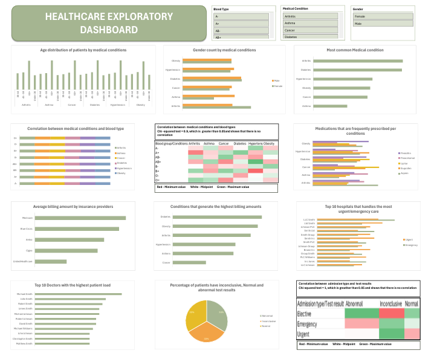

# Data Analytics portfolio

# Project 1

**Title:** [Healthcare Exploratory Dashboard](https://github.com/Jumoke-Lucas/Olajumoke.github.io/blob/main/healthcare_prediction_data.xlsx)

**Tools Used:** Microsoft Excel (Pivot table, Powere query editor, slicers, conditional formatting, text box)

**Project description:** Conducted a comprehensive exploratory analysis of a large scale healthcard dataset. This project features an interactive dashboard that allows users explore healthcard data across multiple dimensions.
The dashboard includes the following features:

Interactive slicers to filter by blood type, medical condition and gender. 

Heatmaps showing the correlation between medical conditions and clood type as well as admission type and test results. 

Dynamic charts updating automatically with filter selections.

Key analysis performed : 
1. Patient demographic analysis :
- Analysed age distribution for different medical conditions
- Identified the most common medical conditions
- Identified gender distribution for different medical conditions 
2. Clinical analysis :
- Investigated correlation between blood types and medical conditions
- Investigated correlation between admission type and test results
- Identified medications that are frequantly prescribed for different conditions
- Investigated the percentage of patients per normal, abnormal and inconclusive test results.
  
3. Hospital operations analysis:
- Identified hospitlas handling most urgent and emergency cases
- Identified doctores with the highest patient load

4. Billing analysis:
- Identified conditions that generate the highest billing amounts
- Compared billing across insurance providers

**Key findings:**
- No significant association was found between blood type and specific medical conditions based on Chi square analysis
- Certain hospitals showed higher concentrations of emergency and urgent cases suggesting specialist facilities
- No significant association was found between admission type and test results based on Chi square analysis
- Individuals 60+ are more likely to be admitted for different medical conditions due to old age

This analysis provides actionable insights into patient demographics, clinical outcomes and hospital operations.

**Dashboard Overview:**

